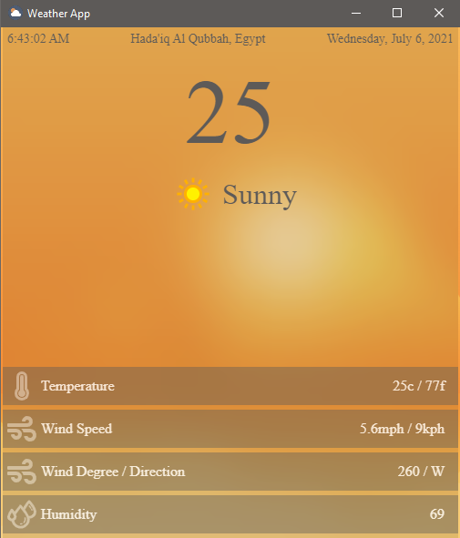

## My Weather Application
## An application display Weather (made for testing electron and electron forge)
 
This application uses RapidApi to fetch weather information, IPIFY to get your ip.
 
**How To USE** 
1- Register at RapidApi 
2- Subscribe to "https://rapidapi.com/weatherapi/api/weatherapi-com" 
3- Get your Host and API keys 
4- store these data in src/assets/js/main.js (the first 2 lines in the file) 
5- run "npm install" to install all dependencies needed for the project 
6- run "npm start" to start your application in dev
7-To build the application run "npm run make"
8- have fun. 

**Notes** 
1- The application needs an active internet connection. 
2- if application didnt load any information press "CTRL+Q" to view a log window 
3- Have fun :) 
    
**PREVIEW**
 

